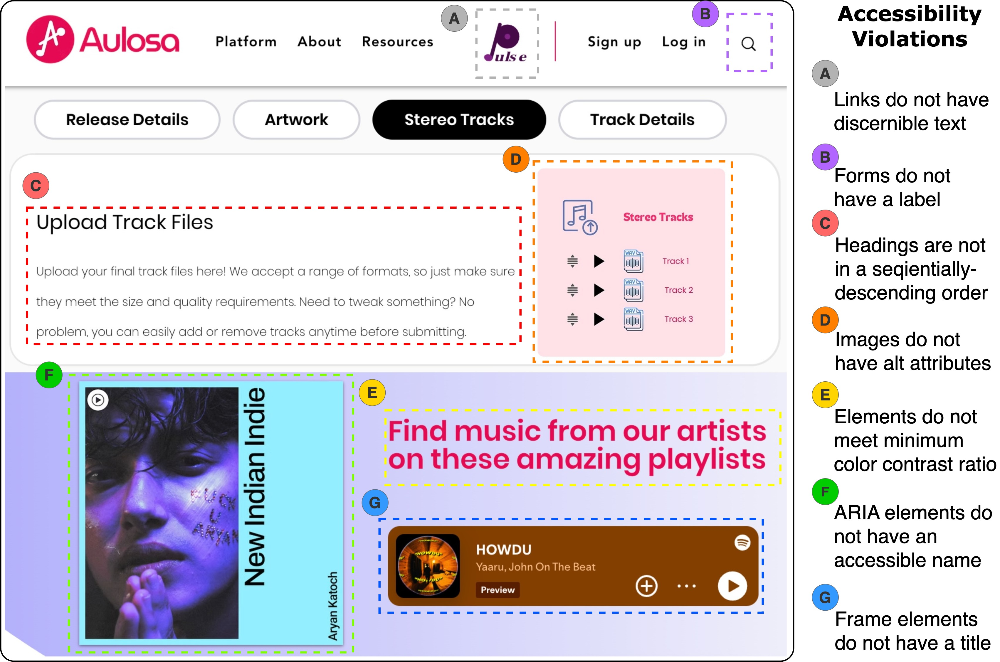
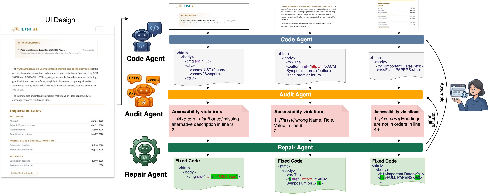

# A11yUI: Generating Accessible UI Code from Screenshots via Tool-Augmented Multi-Agent LLMs


## Table of Contents
- [Table of Contents](#table-of-contents)
- [Getting Started](#getting-started)
- [Approach](#approach)
- [A11yUI Usage](#a11yui-usage)


## Getting Started
UI development from visual artifacts to functional UI code is a time-consuming and error-prone process, requiring developers to carefully translate design specifications into code while ensuring that the implementation satisfies accessibility requirements. 
Although recent advances in multimodal LLMs have created new opportunities for generating UI code directly from design inputs, accessibility remains a significant challenge. 

<p align="center">
 
</p>
<p align="center">Figure: A motivating example of a real-world AI-generated website, Aulosa, contains 7 accessibility violations.</p>

According to the WebAIM Million report, the homepages of the top one million websites contain an average of 57 detectable accessibility violations each.
For example, a real-world landing page from [Aulosa](https://www.aulosa.com/), generated by a popular multimodal LLM code generation tool, contains multiple accessibility violations, including form inputs without associated labels, missing alternative text for images, insufficient color contrast, etc.


To address this limitation, we draw inspiration from how human developers handle accessibility issues in practice.
When implementing a UI, developers often rely on accessibility auditing tools to detect violations and then consult documentation or guidelines to understand how to fix them.


## Approach

<p align="center">
 
</p>
<p align="center">Figure: An overview of A11yUI that generates the accessible UI code from a given UI screenshot.</p>

We introduce an automated approach, A11yUI, for generating accessible UI code from a given UI screenshot. 
It consists of three main components: (i) a **Code Agent**, which leverages a multimodal LLM to generate the initial UI code from the screenshot, (ii) an **Audit Agent**, which invokes multiple accessibility auditing tools and consolidates the detected violations into a unified representation, and (iii) a **Repair Agent**, which retrieves relevant repair guidance from accessibility rules, and iteratively refines the code to resolve the reported issues.


Since web accessibility standards and web code generation are well established, we focus on the web platform (HTML/CSS) in this paper as the primary target domain. 
Nevertheless, the design of our approach is platform-agnostic, which can be generalized to other UI frameworks.

## A11yUI Usage

### Prerequisites

- Python 3.10+
- Conda environment
- Node.js 18+ and npm/npx (required for Lighthouse and Pa11y)
- Internet access (for API calls, CDN-loaded axe script, npm package fetches)

### Setup

#### 1. Create and activate a Python environment with dependencies

```bash
conda env create -f environment.yml
conda activate A11yUI
```

#### 2. Install Playwright browser

```bash
playwright install
```

#### 3. Set API keys

Set backend key.

```bash
## openai_client.py
OPENAI_API_KEY = "<API KEY>"

## gemini_client.py
GEMINI_API_KEY = "<API KEY>"
```

#### 4. Verify API connectivity (optional but recommended)

```bash
python openai_client.py
python gemini_client.py
```

### Run the full pipeline

```bash
python main.py -i test.png -o output -b openai --audit_tool all
```

Key options:

- `--image, -i`: input screenshot path (required)
- `--out_dir, -o`: output directory (default: `./output`)
- `--backbone, -b`: `openai` or `gemini` (default: `openai`)
- `--temperature`: generation/repair temperature (default: `0.0`)
- `--audit_tool`: `axe`, `lighthouse`, `pa11y`, or `all` (default: `all`)
- `--ruleset`: `wcag2a`, `wcag2aa`, `wcag21aa`, `wcag22aa`, `best-practice`
- `--timeout_ms`: audit timeout for Playwright (default: `60000`)

Example using Gemini and only axe:

```bash
python main.py -i test.png -o output -b gemini --audit_tool axe
```

### Expected outputs

Under `output/` (or your `--out_dir`):

- `blocks.png`: detected module boundaries
- `modules_original.json`: generated module code before repair
- `modules_repaired.json`: module code after repair attempts
- `prediction.html/.png`: final repaired page
- `modules/module_XX/`: per-module artifacts, including:
  - `module_input.png`
  - `module_original.html`
  - `module_repaired.html` (if repair succeeded)
  - `audit_before/*.json`
  - `repair_analysis.json`
- `log.txt`

> An example of output of [image](./figures/test.png) is shown in [output](./output/)

### Additional commands

#### Run only accessibility audit on an HTML file

```bash
python run_audit.py --html output/prediction.html --out-dir output/audit --tool all --merge-backend openai
```

#### Repair one HTML using one report

```bash
python repair_html.py --html output/prediction.html --report output/audit/axe_report.json --out-html output/prediction_fixed.html --backend openai
```

### Runtime behavior to be aware of

`main.py` intentionally includes waits:

- `60s` delay before each module repair loop iteration
- `90s` delay before final repair

So total runtime can be long for many modules.

### Troubleshooting

- `OpenAI API key missing` or `Gemini API key missing`
  - Ensure environment variable is exported in the same shell session.
- `npx not found`
  - Install Node.js and confirm `npx -v` works.
- Playwright errors launching Chromium
  - Run `playwright install`.
- axe-core injection fails
  - Ensure internet access to CDN URLs used in `run_audit.py`.
